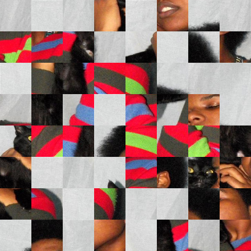

# Huawei_Honor_Cup_华为

<b>Problem:</b>
 
An image was divided into a grid of <b>m</b>x<b>m</b> squares and shuffled. Reconstruct the original image

<b>Solution approach:</b>
 
For each square block in the shuffled image, calculate the root squared difference between it's
borders and all the other blocks borders, considering the 4 possible directions:

left-right

botton-up

right-left

top-down

Build a graph using the blocks as nodes and these differences as weights.

Get the Minimum Spanning Tree to represent the image.

<b>Examples:</b>

  
  

  
  

  
  

  
  

  
  

 

To improve the accuracy rate, post processing might be required.

